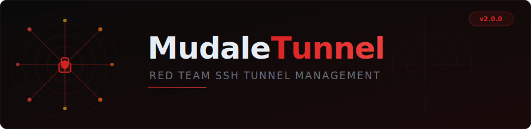

<p align="center">
  
</p>

<p align="center">
  <a href="#quick-start">Quick Start</a> &bull;
  <a href="#tunneling-modes">Tunneling Modes</a> &bull;
  <a href="#architecture">Architecture</a> &bull;
  <a href="#cli-usage">CLI</a> &bull;
  <a href="#web-interface">Web UI</a> &bull;
  <a href="#docker">Docker</a> &bull;
  <a href="#license">License</a>
</p>

<p align="center">
  
  
  
  
  
  
</p>

---

## What is MudaleTunnel?

MudaleTunnel is a red team SSH tunnel management tool that automates service discovery and tunnel creation. It scans targets with **nmap**, then lets you create, manage, and monitor SSH tunnels through both a **CLI** and a **web interface** — with real-time WebSocket updates, health monitoring, and proxychains config generation.

**Zero manual SSH commands.** Point at a target, pick a service, choose a tunnel type, and you're in.

---

## Tunneling Modes

| Mode | SSH Flag | Use Case |
|------|----------|----------|
| **Static** | `ssh -L` | Local port forwarding — direct access to a remote service |
| **Dynamic** | `ssh -D` | SOCKS proxy — route any traffic through the SSH server |
| **Remote** | `ssh -R` | Reverse port forwarding — firewall blocks inbound, but you can SSH out |
| **Remote Dynamic** | `ssh -R port` | Reverse SOCKS proxy — flexible reverse access (OpenSSH 7.6+) |

---

## Quick Start

### Using uv (Recommended)

```bash
# 1. Clone the repo
git clone https://github.com/TarzEH/MudaleTunnel.git
cd MudaleTunnel

# 2. Install dependencies
uv sync

# 3. Run CLI mode
uv run python main.py

# 4. Or run web interface
uv run python main.py web
# Open http://localhost:8000
```

### Using pip

```bash
git clone https://github.com/TarzEH/MudaleTunnel.git
cd MudaleTunnel
pip install -r requirements.txt
python main.py          # CLI mode
python main.py web      # Web interface
```

### Using Docker

```bash
docker compose up -d
# Open http://localhost:8000
```

> **Note:** nmap is auto-installed if missing. See [README_DOCKER.md](README_DOCKER.md) for full Docker docs.

---

## Architecture

```
┌────────────────────────────────────────────────────────────────┐
│                    MudaleTunnel v2.0                            │
│                                                                │
│  ┌──────────────────────┐    ┌──────────────────────────────┐ │
│  │     CLI Interface     │    │       Web Interface          │ │
│  │  Typer + Rich Tables  │    │  FastAPI + Jinja2 + WS      │ │
│  └──────────┬───────────┘    └──────────────┬───────────────┘ │
│              │                               │                 │
│              └───────────┬───────────────────┘                 │
│                          │                                     │
│  ┌───────────────────────▼──────────────────────────────────┐ │
│  │              Tunnel Manager (Core Engine)                  │ │
│  │                                                            │ │
│  │  create / list / stop / health-check / logs / metrics      │ │
│  │  Thread-safe · UUID-tracked · Background processes         │ │
│  └──────┬──────────────────────────────┬────────────────────┘ │
│         │                              │                       │
│  ┌──────▼──────────┐          ┌────────▼─────────────────┐   │
│  │   nmap Scanner   │          │    SSH Subprocess         │   │
│  │  Quick · Full    │          │  ssh -L / -D / -R         │   │
│  │  Stealth · UDP   │          │  Background · Monitored   │   │
│  │  Intense · Svc   │          │  Health-checked            │   │
│  └─────────────────┘          └──────────────────────────┘   │
└────────────────────────────────────────────────────────────────┘
```

### How It Works

1. **Scan a target** — nmap discovers open ports and services
2. **Pick a service** — select from discovered services or enter manually
3. **Choose tunnel type** — static, dynamic, remote, or remote dynamic
4. **Tunnel is created** — SSH subprocess runs in background with monitoring
5. **Manage tunnels** — list, stop, health-check, view logs and metrics

---

## CLI Usage

### Commands

```bash
python main.py                # Default: interactive CLI mode
python main.py cli            # Explicit CLI mode
python main.py web            # Web interface (default: localhost:8000)
python main.py static  ...   # Create static tunnel directly
python main.py dynamic ...   # Create dynamic tunnel directly
python main.py remote  ...   # Create remote tunnel directly
python main.py remote-dynamic ... # Create remote dynamic tunnel
```

### Direct Tunnel Creation

```bash
# Static tunnel: forward remote port 80 to local 8080
python main.py static --user admin --host jumpbox.com --target 192.168.1.100 --port 80 --local-port 8080

# Dynamic tunnel: SOCKS proxy on port 1080
python main.py dynamic --user admin --host jumpbox.com --port 1080

# Remote tunnel: reverse forward internal PostgreSQL to attacker
python main.py remote --user kali --host 192.168.118.4 --bind-port 2345 --target 10.4.50.215 --target-port 5432

# Remote dynamic: reverse SOCKS proxy
python main.py remote-dynamic --user kali --host 192.168.118.4 --socks-port 9998
```

### Interactive CLI Workflow

```
┌─ Main Menu ─────────────────────────────────────┐
│  1. Scan target and create tunnel               │
│  2. Manage existing tunnels                     │
│  0. Exit                                        │
└─────────────────────────────────────────────────┘
         │
         ▼
┌─ Scan Results ──────────────────────────────────┐
│  ┏━━━━━━━━━━┳━━━━━━━━┳━━━━━━━━━━┓              │
│  ┃ Port     ┃ State  ┃ Service  ┃              │
│  ┡━━━━━━━━━━╇━━━━━━━━╇━━━━━━━━━━┩              │
│  │ 22/tcp   │ open   │ ssh      │              │
│  │ 80/tcp   │ open   │ http     │              │
│  │ 443/tcp  │ open   │ https    │              │
│  └──────────┴────────┴──────────┘              │
└─────────────────────────────────────────────────┘
         │
         ▼
┌─ Select Tunnel Mode ────────────────────────────┐
│  1. Static  (ssh -L)  — local port forwarding   │
│  2. Dynamic (ssh -D)  — SOCKS proxy             │
│  3. Remote  (ssh -R)  — reverse forwarding      │
│  4. Remote Dynamic    — reverse SOCKS proxy     │
└─────────────────────────────────────────────────┘
```

---

## Web Interface

Start with `python main.py web` and open `http://localhost:8000`.

### Features

| Feature | Description |
|---------|-------------|
| **Target Scanning** | Enter IP/domain, select scan type, view discovered services |
| **Tunnel Creation** | Tabbed interface for all 4 tunnel types with form validation |
| **Active Tunnels** | Real-time status via WebSocket, color-coded indicators |
| **Tunnel Actions** | View details, logs, metrics, or stop individual tunnels |
| **Proxychains Generator** | Generate proxychains config for SOCKS tunnels |
| **Scan History** | Track all past scans with type, status, and service counts |

### Web Options

```bash
python main.py web                          # Default: localhost:8000
python main.py web --port 8080              # Custom port
python main.py web --host 0.0.0.0 --port 9000  # Network-accessible
```

---

## Proxychains Integration

After creating a dynamic or remote dynamic tunnel, generate a proxychains config:

```bash
# 1. Create SOCKS tunnel
python main.py dynamic --user admin --host jumpbox.com --port 1080

# 2. Add to /etc/proxychains4.conf:
socks5 127.0.0.1 1080

# 3. Route tools through the tunnel
proxychains nmap -sT -Pn 172.16.50.217
proxychains smbclient -L //172.16.50.217/ -U user
```

The web UI includes a built-in proxychains config generator.

---

## Docker

```bash
# Docker Compose
docker compose up -d

# Or build manually
docker build -t mudaletunnel .
docker run -d -p 8000:8000 mudaletunnel
```

See [README_DOCKER.md](README_DOCKER.md) for detailed Docker documentation including network modes and SSH key mounting.

---

## Project Structure

```
MudaleTunnel/
├── main.py                 # Entry point — Typer CLI + web server launcher
├── MudaleTunnelUI.py       # CLI interface — Rich tables, menus, interactive flow
├── tunnel_manager.py       # Core engine — create, list, stop, health-check tunnels
├── web_app.py              # FastAPI web app — REST API + WebSocket + Jinja2
├── config.py               # Configuration defaults
├── templates/              # Jinja2 HTML templates (web UI)
├── static/                 # CSS + JS assets (web UI)
├── Dockerfile              # Container image
├── docker-compose.yml      # Docker Compose config
├── pyproject.toml          # Python project metadata + dependencies
├── requirements.txt        # pip dependencies
└── README_DOCKER.md        # Docker-specific documentation
```

---

## Dependencies

| Package | Purpose |
|---------|---------|
| [Typer](https://typer.tiangolo.com/) | CLI framework with type hints |
| [Rich](https://rich.readthedocs.io/) | Terminal UI — tables, progress bars, styling |
| [FastAPI](https://fastapi.tiangolo.com/) | Web interface backend |
| [Uvicorn](https://www.uvicorn.org/) | ASGI server |
| [Jinja2](https://jinja.palletsprojects.com/) | HTML templating |
| [WebSockets](https://websockets.readthedocs.io/) | Real-time tunnel status updates |

---

## Prerequisites

- **Python 3.9+**
- **SSH client** (pre-installed on Linux/macOS)
- **nmap** (auto-installed if missing)
- **Docker** (optional — for containerized deployment)

---

## Disclaimer

MudaleTunnel is a security research and penetration testing tool. **Only use it against systems you own or have explicit authorization to test.** Unauthorized access to computer systems is illegal. The authors are not responsible for any misuse.

---

## License

[MIT](LICENSE) &copy; Ori Ashkenazi
